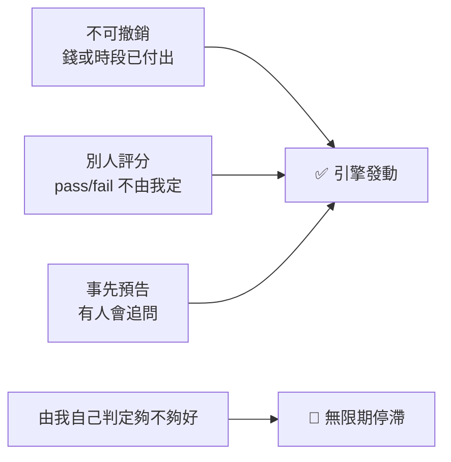
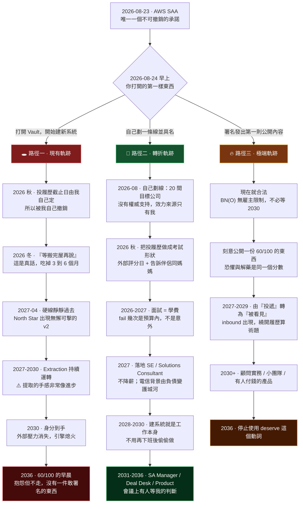

# 三條軌跡推演 (2026-07-21)

> **核心一句：** 分岔點不是 2026-08-23（SAA 考試），是 **2026-08-24 早上你打開的第一樣東西**。三條路的分歧，總共不超過兩個小時。

關聯：[[North Star — Role Reality & Exit Strategy]] · [[Career Hub Goal]] · [[SA Presales Transition]] · [[常數 - Impact 要可見才算數(Legible Impact)]]

**用法：** 不是日記。每季 review 時對照 §5 的預警訊號，看自己實際落在哪一條。出處：2026-07-21「時空觀察者」訪談（5 題）。

---

## 1. 引擎規格（先講機制，路徑只是機制的後果）

Vault 裡每一件**真正執行了**的事，都同時具備三個條件；每一件**停滯**的事，都缺其中至少一個。

| 執行了 | 停滯了 |
|---|---|
| AWS SAA 考試（付了錢、pass/fail、已告訴伴侶同媽媽） | CV Generator M2（及格線我自己定） |
| SCQA（有會議時間、有人在對面） | R/Y/G 記分板（停在 W0） |
| /tidy-meeting-transcript、/fill-daily-log（當天要用） | Build-in-public（沒有人在等） |

**結論：** 阻力不是動機、時間或計畫品質（診斷已經正確過五次，全部沒有改變行為）。阻力是 **self-authorisation：我不接受自己簽發的證書。**

**佐證：** 碩士差 0.2 分的 distinction 至今仍出現在不同時期的文件裡；7/19 自評「80/100 的 prep 換不到 80/100 的 SCQA」；而評審席上其實沒有人（伴侶只要求「像成年人一樣為自己的決定負責」，媽媽只希望「多去試、不要猶豫」）。

---

## 2. 已更正的地基（2026-07-21）

| 項目 | 事實 | 對計畫的意義 |
|---|---|---|
| 簽證 | **BN(O)，非工簽** | 不需雇主擔保。任何公司、自僱、接案、開公司皆可，**現在就合法**，不用等永居。 |
| 時鐘 | 算**居住**不算受僱，約 4 年到公民身分（≈2030） | 空檔不斷鏈。唯一風險是把我調離英國的工作。 |
| 薪酬 | **不可降薪**，除非有清晰晉升路徑且產業/scope 對齊 | 目標落在企業軟體 / 雲廠 SE 的市場價區間。 |
| 住房 | 2027 前搬家，很可能租 | ⚠️ 這是日曆上最有說服力的下一個延期理由。 |

> **關鍵推論：** 沒有任何外部法規替我收窄目標名單。**窄化必須由我自己劃線，並承認這條線是我劃的。** 這正是全部的難處所在。

---

## 3. 三條軌跡

### 🕳 路徑一 · 現有軌跡：五次合理的延期

**這條路不會有任何一刻感覺像失敗。這正是它的殺傷力。**

SAA 會過（引擎規格全中）。然後 10 週衝刺的後半段——投履歷——**沒有評分的人**，截止日由我自己定，所以可以被我自己撤銷。它會被撤銷，並被一句「先把 question bank 補完」合理化。接著搬家（真實、有日期、社會上完全站得住腳）吃掉一季。2027-04 靜靜過去。

2027 到 2030，Extraction Mode 會運轉得**很好**，這是最危險的部分：**提取的手感非常像進步。**但提取物只在被兌現那天才有價值。與此同時履歷停在同一個座位，「九年壓縮成兩年」變成「十三年壓縮成兩年」，因為**時間在低天花板的位置不會複利**。

2030 身分到手時，支撐一切的外部壓力消失，引擎找不到燃料。到 2036，Vault 裡累積了十五份精準的診斷，變成一座**正確診斷的博物館**。

**觸發這條路的不是懶惰，是「我先準備好再說」。它的建成材料，從來都是真話。**

### 🚪 路徑二 · 轉折軌跡：把自我裁決外包，直到敢自己簽字

**關鍵的不同決定不是「更努力」，是：不再等自己變勇敢，改為把每件重要的事硬做成 SAA 的形狀。**

三個改動全部是「換形狀」，不是「加努力」：

1. **自己劃線。**20 間目標公司（賣給電信/企業的雲廠與軟體商），沒有任何法規替我篩選，這條線的效力來源只有我自己。
2. **把投履歷做成考試。**選一個我控制不了的評分日（已預約的面試、recruiter call），然後**告訴伴侶同媽媽日期**——用 7/13 用過的同一招。已知有效。
3. **停止 ship M2。**它的致命傷不是難，是**及格線由我定，而我永遠不會簽字**。改為選有內建評分者的產出：有日期的內部匯報、面試技術環節、要在某日交出的 demo。

**代價（不粉飾）：** 被評分的次數大幅增加，而且會 fail 幾次。[[SA Presales Transition]] 的 Gate 3 早就寫過：**the first two interviews are tuition。**這條路需要把那句話從紙上兌現。

### 🔥 路徑三 · 極端軌跡：拆掉評審席

**最大的恐懼，精準命名：不是失敗，不是被評分。是「由我自己判定它夠好，然後被人看見」。**

路徑一與路徑二仍在同一個世界觀裡運作（尋找有資格認證我的權威；一個等不到，一個聰明地借用）。路徑三是把整張評審席拆掉：**不再申請成為那個角色，直接開始做那個角色的事，並且公開署名。**

BN(O) 之下這條路**現在就合法**。沒有雇主障礙、沒有簽證障礙。只剩一樣東西擋著：**我自己的簽名。**

入場費很殘忍地就是恐懼畫面裡的那個數字：怕的是「keeping a 60/100 output not being admired by anyone」，而第一件事是**刻意公開發表一份 60/100 的東西**。

> **私下藏著的 60 分會腐爛；公開發出去的 60 分，是通往 90 分的唯一已知路徑。**

終點不在事業，在語法：今天說的是「I deserve a better job」（申訴句，預設有一個仲裁者欠我裁決）。走完這條路的人會停止使用 deserve，因為**當我自己蓋章、自己承擔、自己被看見之後，「值不值得」這個問題會失去主詞。**

---

## 4. 三條路的比較

| | 🕳 路徑一 | 🚪 路徑二 | 🔥 路徑三 |
|---|---|---|---|
| **核心動作** | 我先準備好再說 | 把事情做成考試形狀 | 自己蓋章然後被看見 |
| **誰在評分** | 沒有人（所以不動） | 借來的外部評分者 | 我自己 + 陌生人 |
| **2027 的位置** | 同一個座位 | SE / Solutions Consultant | 受僱 + 公開身分並行 |
| **2036 的畫面** | 60/100 的早晨，抱怨但不走 | 有人等我的判斷 | 名字附在東西上 |
| **最大風險** | 每一步都有好理由 | fail 幾次，會痛 | 公開的 60 分，會被看見 |
| **合法性** | — | — | ✅ 現在就可以（BN(O)） |

---

## 5. 預警訊號（每季 review 對照）

- 🔴 **落入路徑一：** 這場對話之後又建了新系統 / 新 run 檔案 / 新 canvas；出現「等 X 完成再開始」的句型（X = 搬屋、SAA、M2、市場時機）；日誌「What actually happened today」再次連續空白；North Star 出現新的 v 修訂而行為沒變。
- 🟢 **落在路徑二：** 日曆上出現一個**我控制不了**的日期；有第三個人知道那個日期。
- 🟠 **落在路徑三：** 有一件署名的東西已經發出去，而且我知道它只有 60 分。

---

## 6. 今天唯一該產生的東西

不是新系統。是 [[North Star — Role Reality & Exit Strategy]] §7 Amendment Log 的一行字，**和這一頁記錄。其餘不動。**

> **下一個真實的分岔口：2026-08-24 早上。**
