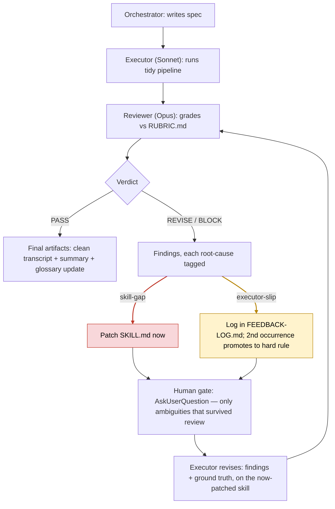
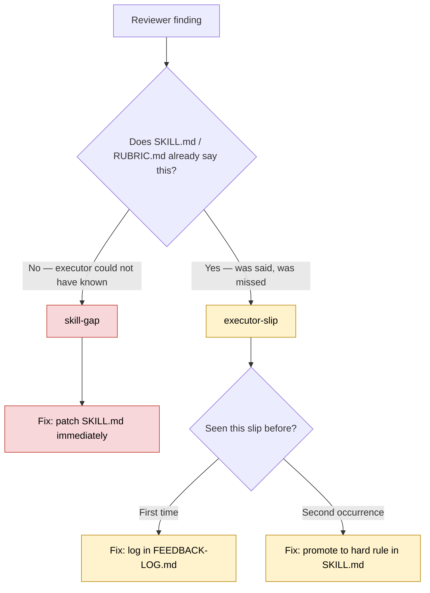

 # Skill: Transcript → Meeting Summary（逐字稿整理 + 出摘要 + 存檔）

> 用途:你在 Obsidian Claude 側邊欄丟一個「第一版逐字稿」的路徑,它就 ① 忠實清理逐字稿 → ② 產出群組格式摘要 → ③ 存進對應會議筆記。
> 觸發:跟側邊欄說「整理這份逐字稿 <路徑>」「turn this transcript into a summary」之類。
> 安裝:把下方 `SKILL.md` 整段貼進 **Settings > Capabilities**(本筆記只是設計稿,不會自動變 skill)。

## SKILL.md(可直接複製安裝)

```markdown
---
name: transcript-to-meeting-summary
description: Use when chukwan gives a path to a raw/first-draft meeting transcript and wants it cleaned and turned into a saved meeting summary. Trigger on a transcript file path, "整理逐字稿", "clean  
---
<!-- leading word: TBD（候選 faithful / [?]） -->

The raw transcript is ASR and is often far from what was actually said. Your job is **faithful cleanup, never invention.** Run in order.

1. Read the transcript at the path given. Completion: you have the full text. If the path is wrong or empty, ask before doing anything else.

2. Clean it — fix obvious ASR garbles and restore meaning, preserving every speaker's intent and all numbers/dates/names.
   - **Self-catch:** NEVER invent content to fill a gap. If a word, number, name, term or event is unclear, keep your best guess and mark it `[?]`; do not silently "improve" it. Fabricating to make it read smoothly is the exact failure this skill prevents.
   - Link known people to their CRM note as `[[Name employee_id]]` (check the `Relationship Management/` folder); leave unknown names plain.
   - Gloss/flag unfamiliar jargon, acronyms and event names with `[?]`, using `[[5T Group Handover - Brief, Terminology & Summary Format]]` as the reference where possible.
   - Save the cleaned transcript to `Operation Note/Meeting Transcript/<date> Meeting - <topic> - Transcript.md`. Do NOT overwrite the raw draft unless asked.
   - Completion: cleaned file saved; every uncertain item carries `[?]`.

3. Generate the formatted summary from the cleaned version, in the meeting's own language, using the group's morning-meeting format:
   ```
   <M.D> Morning Meeting Minute (<account> part)
   1. <topic / action> _<owner>
   2. ...
   ```
   Chinese variant: `DD/MM N组晨会内容及待办（<帐户>）：` then `事項 -负责人`.
   One line per decision/action, each with its owner; no narration; nothing beyond what the transcript supports.
   - Completion: every action line has an owner; no invented items.

4. Save the summary into the relevant meeting note under `Operation Note/`.
   - Find an existing meeting note for this meeting (match date + topic). If none exists, create one from `Template/Meeting Note Template.md` (frontmatter: type: meeting-note, date, account_or_project, attendees, hub: "[[Life @Huawei System]]"). Attendees linked to CRM.
   - Put the summary under a `## Summary` heading (or the group-format block). Link the cleaned transcript.
   - Completion: summary saved inside the meeting note.

End by telling chukwan the saved file path and listing **every `[?]` flag** as a short "please confirm" list. He can't reliably verify Mandarin ASR, so surfacing uncertainty is the whole point — do not bury it.
```

## 設計筆記(為何這樣寫)
- 解決的問題:ASR 逐字稿常偏離原話 → 需要忠實清理 + 不臆造 + 把不確定攤出來給你核。
- Invocation:model-invoked,側邊欄聽到「路徑 / 整理逐字稿」就跑。
- 已套用的 gap 修正(對照 Matt writing-great-skills):每步有 completion criterion;self-catch 寫成硬觸發(「fabricating … is the exact failure this skill prevents」);description 一個 branch 一個 trigger;結尾強制列出 `[?]` 清單(避免 premature completion / 把不確定藏起來)。
- 編碼了你 vault 的慣例:逐字稿放 `Operation Note/Meeting Transcript/`、會議筆記放 `Operation Note/`、人名連 CRM、術語查交接筆記、群組摘要格式。
- 待決:leading word(候選 faithful / `[?]`)。

## The Executor / Reviewer Feedback Loop（執行者/審核者回饋迴圈 — 2026-07-13 run log）

On 2026-07-13 the *installed* pipeline (`.claude/skills/tidy-meeting-transcript/`) ran end-to-end against `13-7-2026 Meeting - Monday Download - Transcript.md`, exercising the executor/reviewer loop this design doc anticipates. Three roles, three channels:

- **Orchestrator (Fable, main session)** — writes the spec, owns the only channel to chukwan (`AskUserQuestion`), owns every edit to `SKILL.md`. Never tidies transcripts itself.
- **Executor (Sonnet subagent)** — runs the tidy pipeline. Hard rule: *flag, don't guess.* Cannot talk to the human.
- **Reviewer (Opus subagent)** — grades the executor's output against `RUBRIC.md`, reading the raw transcript as ground truth. Never edits files.

Every reviewer finding gets exactly one root-cause tag, and the tag — not the severity — decides the fix:

| Tag | Meaning | Fix |
|---|---|---|
| `skill-gap` | The skill never said it; the executor could not have known. | Patch `SKILL.md` immediately — not the executor's fault. |
| `executor-slip` | The instruction existed and was missed. | Log it in `FEEDBACK-LOG.md`. Second occurrence promotes it to a hard rule in `SKILL.md`. |

### Run-time loop



### Root-cause triage



Severity is orthogonal to root cause and just sets urgency: **BLOCKER** (wrong info that misleads — misattributed speaker, invented content, wrong action-item owner) / **MAJOR** (a skill rule violated) / **MINOR** (polish).

### Worked example — Run 1 (verdict: BLOCK)

| Finding | Severity | Root cause | Fix |
|---|---|---|---|
| Sonnet called a speaker ID "a genuine coin-flip … should be confirmed by the user" in its own open questions, then stamped that name onto 3 lines of the paste-ready minute anyway. | BLOCKER | `skill-gap` | New **confidence gate**: high → commit; medium → commit with `⚠` + open question; low → no name anywhere, `_TBD`. "I can't ask the human" resolves to *leave unattributed*, never *guess and flag*. |
| Opus disproved a candidate on a test nobody had written down — the speaker used native Mandarin idiom (踢皮球, 扛着), ruling out a non-native-speaking colleague. | MAJOR | `skill-gap` | Codified as one of four **disproof tests**: self-reference / presence / register / role-consistency. |
| Both mappings in the skill's own known-mappings table were broken wikilinks — would have minted duplicate person notes. | MAJOR | `skill-gap` | Wikilinks fixed; rule added to confirm the target note exists before writing any `[[wikilink]]`. |
| An Otter.ai `Speaker N` label was assumed to be one person; diarization had actually merged two colleagues under `Speaker 2`. Caught only by the human, after all three roles missed it. | BLOCKER | `skill-gap` | Now rule 1.4b.0 — treat a suspiciously broad behavioural fingerprint as evidence of a merge, not of seniority. The highest-value gap of the run. |

Run 1 produced **both** kinds. The four above were `skill-gap`s and were patched into `SKILL.md` immediately. Six more were `executor-slip`s — the Download Summary written in Chinese when Step 4 says English; a digest line that invented a claim about competitors' costs; a Host field that contradicted the executor's own role analysis; an undisclosed normalization. Those were **not** patched: the instruction already existed, so per the promotion rule they were logged to `FEEDBACK-LOG.md` and become hard rules only if they recur. That restraint is deliberate — patching a slip on first offence bloats the skill with things it already says, and a skill nobody can hold in their head stops being read.

**The honest lesson:** the loop caught a lot — most findings came from Opus reading the raw transcript against the rubric. But the single most expensive error (the merged `Speaker 2`) got past the executor *and* the reviewer, and surfaced only when chukwan looked at the output himself. The human-in-the-loop gate isn't ceremonial — it's load-bearing. A two-role AI loop finds what it already knows to check for; it takes a human to notice the thing nobody thought to write a check for.

## 連結
- 術語/格式來源: [[5T Group Handover - Brief, Terminology & Summary Format]]
- 會議筆記範本: [[Meeting Note Template]]
- 相關 skill: [[Skill - Data Submission Gate]] · [[Skill - Structured Problem Solving]]
