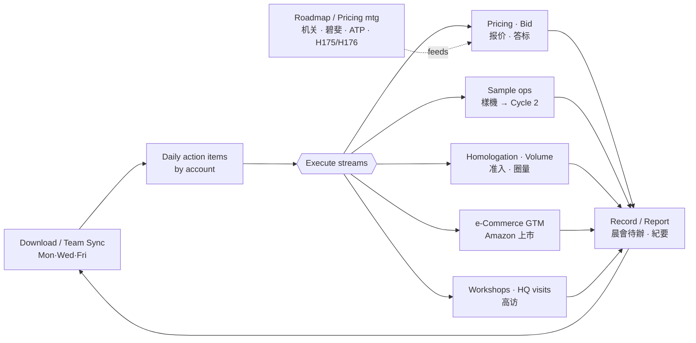
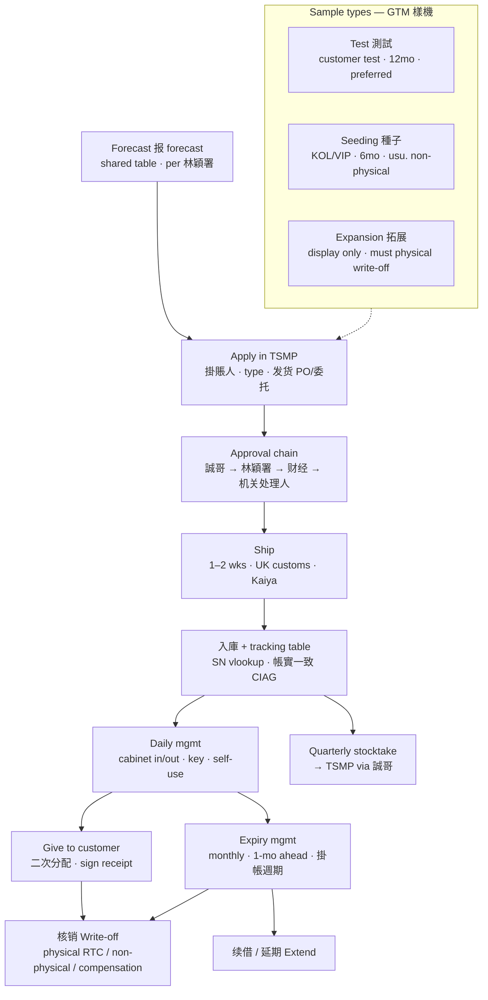
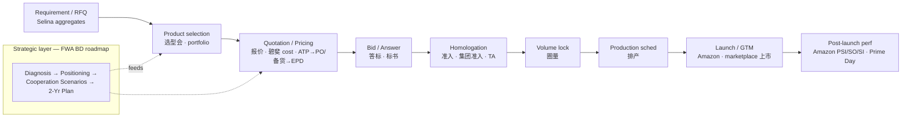

[[8-7-2026 SCQA Prep]]
# H3G Operating Model — Three Cycles

> My working map of the account's three cycles, drawn from our notes/meetings. Use for the SCQA "Product / Operation understanding". ⚠ = my onboarding read — verify with manager/Ziyi ("True or Not").
> Sources: [[16-6-2026 Meeting - Sample Management Practical Training]] · [[Source Note - Sample Management Knowledge]] · [[5T Group Handover - Brief, Terminology & Summary Format]] · [[FWA Business Development V1 (22-6-2026)]] · [[2-7-2026 Product Roadmap Meeting Notes]]

---

## 1 · H3G Operation Cycle（運營循環 — the day-to-day rhythm）
> The recurring loop that runs the account. **My pain point lives here**: the `H→H→Record→H→H` relay between Execute and Reco

---

## 2 · Sample Management Cycle / Components（樣機管理 — my core mandate）
> GTM sample lifecycle. Ends only at **核销** (write-off) or **续借/延期**; the golden rule is **帳實一致 (CIAG)**.

---

## 3 · Sales Cycle（銷售循環 — deal flow, strategic layer feeds it）
> Commercial flow from customer need → launch. The **Strategic cycle** (FWA BD roadmap) sits above and feeds selection/pricing — which is why "Strategic could be part of Sales".

---

## How the three connect (one line)
- **Operation** is the *cadence* (sync → execute → record) that keeps everything moving; **Sample** and **Sales** are two of the streams it executes and reports on.
- **Sample** is where I own the full lifecycle today (heavy/ops); **Sales** is where I want to grow, fed by the **Strategic** roadmap layer.

> ⚠ Verify with manager/Ziyi: the **Sales-cycle ordering** (选型会 vs 报价 vs 准入 sequence) and whether the **Operation streams** are the right set — these are my reconstruction, ideal "True or Not?" material for Wed.
