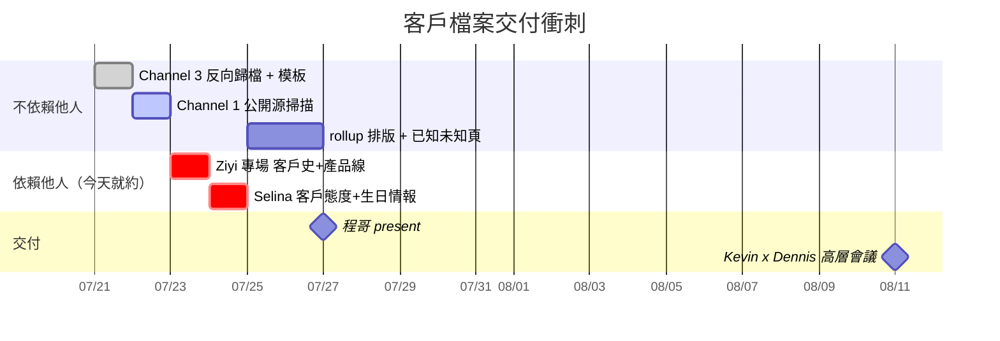

# 27-7-2026 SCQA Prep — 客戶人物檔案交付

母會議來源：[[20-7-2026 SCQA Transcript]]（原排程 [[20-7-2026 SCQA Prep]] 定在 7/22，實際提前到週一 7/20 發生）
交付對象：[[Ding Cheng 00611102 (程哥or 丁程)]] · 交付日：**2026-07-27（週一）**

> **本次唯一硬指標**：交出一份 per-person 的和記（H3G / CKH-IOD）客戶人物檔案，深到含生日、態度與歷史事件，且任何人拿去看都看得懂。
> **第二軌（無交付物，口試）**：產品 portfolio 要能不看 PPT 對程哥完整串講。

---

## 📊 進度總覽（2026-07-21 基線）

**Tier A 四人 × 欄位覆蓋率**

```
整體      ████████░░░░░░░░  48%   (15.5 / 32 格)
```

| 人物 | 覆蓋 | 進度條 | 備註 |
|---|---|---|---|
| [[Francesco Zampini]] | 5.5/8 | `███████████░░░░░` 69% | 職務與治理最完整 |
| [[Dennis Lui]] | 5/8 | `██████████░░░░░░` 63% | 事件最多，人的部分全空 |
| [[Agostino Ruberto]] | 4/8 | `████████░░░░░░░░` 50% | 態度最明確，但層級三版本衝突 ⚠ |
| [[Joe Parker]] | 2/8 | `████░░░░░░░░░░░░` 25% | **最大缺口，卻是程哥開場第一個問的人** |

**欄位 × 完成度（跨四人）**

| # | 欄位 | 進度條 | 來源管道 |
|---|---|---|---|
| 1 | 職責 | `████████████████` 100% | ✅ vault 已有 |
| 2 | 匯報線 | `██████████████░░` 88% | ✅ vault 已有（1 處衝突待解）|
| 3 | 彼此關係 | `████████████░░░░` 75% | ✅ vault 已有 |
| 4 | 對華為態度 | `██████░░░░░░░░░░` 38% | 🟡 需 Selina / 程哥 |
| 5 | 歷史好壞事件 | `██████████░░░░░░` 63% | 🟡 需 Ziyi 補意大利側 |
| 6 | **來和記前的經歷** | `░░░░░░░░░░░░░░░░` **0%** | 🔴 Channel 1（LinkedIn）|
| 7 | **在和記年資** | `░░░░░░░░░░░░░░░░` **0%** | 🔴 Channel 1（LinkedIn）|
| 8 | **年紀 / 生日** | `░░░░░░░░░░░░░░░░` **0%** | 🔴 Channel 1（Companies House）+ Selina |

> ### 🔑 掃描的核心發現
> **程哥指名的八欄裡，有三欄是跨四人全零 —— 而且正好是 vault 永遠不可能有的三欄。**
> 職責／匯報線／關係之所以「已經有」，是因為它們來自 PPT 和關係圖；經歷／年資／生日之所以全空，是因為沒有人把客戶當「人」記錄過。
> 這正是你上週回報「深度停在表面」的結構性原因 —— **不是你查得不夠，是這個團隊的知識庫裡從來沒有這一層。**
> 👉 推論：**把這三欄補起來，交付物本身就是團隊裡不存在的東西**，而不只是一份作業。這也是講給程哥聽的 framing。

---

## 🧩 欄位設計（8 欄基準 + 5 欄提案）

### A. 程哥指定的 8 欄（必填，不可刪）
1. 職責 —— 現在具體管哪一塊
2. 匯報線 —— 向誰匯報、與誰平級
3. 彼此關係 —— 客戶內部的人際結構
4. 在和記年資
5. 過往經歷 —— 來和記之前做什麼、過去 10–15 年
6. 對華為態度
7. 歷史事件 —— 好的壞的都列
8. 年紀與生日

### B. 我提案追加的 5 欄（理由附後）

| # | 欄位 | 為什麼值得加 |
|---|---|---|
| 9 | **華為側對接人（Owner / Sponsor）** | vault 裡已有現成答案（Agostino & Mark → Selina；Marlene & Francesco → 程哥；Dennis → 曾黎／榮濤）。加上這欄，檔案立刻從「人事資料」變成**覆蓋度地圖**——一眼看出哪個客戶沒人管。這是程哥身為 Account Director 最想要的一張表。 |
| 10 | **決策角色（DM / Champion / Gatekeeper / Blocker）+ 品類** | 標準 key-account 詞彙，關係圖裡其實已標了（Agostino = Decision Maker + Champion）。用行業語言呈現，等於同時完成你的對外資產（Deal Desk / Presales 履歷素材）。 |
| 11 | **下一次接觸點（Next touchpoint）** | 🔥 最高價值。掃描發現 **8 月 11–13 日有 [[He Gang 00866077 (Kevin)]] × [[Dennis Lui]] 高層會議**（程哥 7/1 自己派的任務），Q3 還有 Mid-year Roadmap Workshop 與 Q4 HQ Visit。把「下一次見到他是什麼場合」寫進檔案，交付物就從**靜態資料**變成**可執行的排程武器** —— 而且直接接上程哥手上的活。 |
| 12 | **關切議題 / Hot buttons** | 「態度」是形容詞，「他在追什麼」才可行動。已知：Dennis → 手機回歸歐洲 + 香港市場表現 + Aurora Store（他自己不熟）；Francesco → 定價與 ranging；Agostino → 測試結果。生日要辦活動，hot button 才是平時能講的話。 |
| 13 | **來源與可信度（Source / Confidence）** | 這批資料大量是二手轉述，且已出現至少一組互相矛盾的說法。**把傳聞當事實講給程哥，是這份交付唯一真正的風險。** 每格標來源與 High/Med/Low，才是專業情報品，不是八卦彙整。 |

> 建議 9–13 全上，但**排版上收成一行 meta 列**，不要膨脹成 13 欄的表格。八欄照程哥的順序走，追加欄位放在每人檔案的頁首當「行動摘要」。

---

## 🔍 Channel 3 掃描成果（2026-07-21 已完成）

掃過：`Operation Note/Meeting Transcript/`（8 份）、`Meeting Notes/`、`Knowledge/Source/Life at Huawei/`（Events × 4、FWA Roadmap、5T Handover）、`Relationship Management/`（14 張 customer 卡）、O2 / O5 canvas。

### 撿到的新料（原本散落、未歸檔到人）

- **🔥 [[He Gang 00866077 (Kevin)]] × [[Dennis Lui]] 高層會議，8 月 11–13 日（TBD）** —— 程哥 7/1 Wednesday Download 親自派的任務（原記「Cameron & Dennis range review, 11–17 Aug」，同日 refined 版改為 Kevin & Dennis executive meeting）。這是你的檔案**最直接的下游使用者**：交付日 7/27 到會議日只剩兩週。
  - 出處：[[1-7-2026 Wednesday Download Transcript]]
- **[[Dennis Lui]] 的三個 follow-up（程哥 6/24 親自見面後）**：① 要看華為手機在**香港市場**的表現（因為手機明年回歸歐洲，他想先看香港）② 手機回歸涉及**準入測試**，要求先拿到裝最新 Aurora Store 的機器試用 → 觸發那次緊急樣機（Pura 90 缺貨 → Mate X7 頂上 → 跨境調撥意大利）③ **他本人不了解 Aurora Store**，程哥要做一頁英文摘要發給他。
  - 出處：[[24-6-2026 Meeting - Wednesday Download - Transcript]]
  - 👉 這三條同時給你：態度證據、歷史事件、hot buttons —— 一次填三欄。
- **四場已發生的高層活動，四人的實際同框紀錄**：MWC Strategic Alignment Summit（2026-03-02，Dennis + Francesco + Agostino + Marlene 全到）、Q1 Device Forum（Francesco + Marlene + Mark + Manjit）、Rome Smartphone Technical Workshop（6/5，意大利技術群）、Ecosystem Workshop（Aurora Store，7/15 前已辦）。
  - 出處：`Knowledge/Source/Life at Huawei/Events/` × 4
- **治理論壇與我方觸達率**（可直接當「接觸點」欄）：Francesco 主持 Commercial / Procurement Board（1–2 次/月，華為觸達 ~70%）；Agostino 主持 Technology Board（1–2 次/月，~90%）；Dennis 主持 Executive Committee（2–3 次/年，~50%）。
- **[[Manjit Dhanjal]]**：Sr. Vendor Manager，[[Francesco Zampini]] 之下，負責 smartphone / wearable / B2C portfolio。7/15 會上才首次出現、當時姓氏未確認，現已有卡片 → **Tier B 應補**。
- **對接分工（Ziyi 7/10 交接原話）**：Agostino & Mark → Selina；Marlene & Francesco → 程哥；Dennis 那層要上升到 曾黎 / 榮濤。
- **⚠ 合規限制**：Selina 手上那版精細客戶關係圖 **不能拍照，連對螢幕都不行**（Ziyi 明確交代）。→ 交付物必須是**你自己重建的內容**，不能是翻拍或轉貼。

### ⚠ 掃出的矛盾（必須在 7/27 之前解掉，或當作提問拋回去）

**[[Agostino Ruberto]] 到底在哪一層？三個版本：**

| 版本 | 說法 | 出處 |
|---|---|---|
| A | CKH-IOD **CTO**，與 Francesco 同為 Top-3 決策人 | Relationship Mapping v1（15-7）|
| B | 在 **Marlene 之下**，管手機／手錶選型 | Ziyi 7/10 交接培訓 |
| C | 「整個技術的負責人」，**與 Francesco 平級**；IOT 產品線對 Dennis 匯報 | 程哥 7/20 本人口述 |

> 處理方式：**不要在會上自己選一個講。** 三版並列，指出差異，用 SCQA 的「True or Not?」把它拋給程哥拍板 —— 這既是誠實，也是最好的 build-connection 素材（他會發現你真的讀進去了）。

**次要待確認**：何剛（Kevin）究竟在 CBG 還是 MSS？朱平（MSS 總台）工號與拼法未核實。LT 指哪個單位？

---

## 📅 排程（7/21 → 7/27）

> **約束：SAA 每日 1 小時基礎層不動，缺口用 OT 補。**



| 日 | 工作時間 | OT / 晚間 | SAA |
|---|---|---|---|
| **7/21 二** | Channel 3 歸檔（已完成）· **今天就發訊息約 Ziyi 與 Selina** | 八欄模板套進四張卡 | 1h ✅ |
| **7/22 三** | Channel 1：LinkedIn + Companies House | 補「經歷／年資／出生年月」 | 1h ✅ |
| **7/23 四** | **Ziyi 專場 60–90 分鐘**（客戶史 + 產品線一次拿完）| 當晚整理，趁記憶新 | 1h ✅ |
| **7/24 五** | Selina 20–30 分鐘（態度、關係、生日）| 補洞 | 1h ✅ |
| **7/25–26 週末** | rollup 排版 + 已知未知頁 | 產品時間線自習 + 出聲串講 ×2 | — |
| **7/27 一** | **Present** | — | 1h ✅ |

**排序原則**：先做不依賴別人的，把依賴別人的時段**今天就卡死**。不要等資料齊了才約人。

---

## ⏳ 風險登記

| # | 風險 | 影響 | 對策 |
|---|---|---|---|
| 1 | **[[Ziyi Zhang 84434577]] 的窗口** —— 客戶歷史與產品線兩條線都靠他 | 🔴 高 | 7/23 那格不能滑。客戶 + 產品**同一場問完**，不要分兩次 |
| 2 | Joe Parker 檔案只有 25%，而程哥開場第一個問他 | 🟠 中 | Selina 那場專門留 5 分鐘問 Joe |
| 3 | 三版 Agostino 層級衝突 | 🟠 中 | 不自己裁決，改成 True-or-Not 提問 |
| 4 | 生日／年齡可能真的拿不到 | 🟡 低 | Companies House 董事出生年月為法定公開；拿不到就進「已知未知」頁 |
| 5 | 關係圖不能拍照 | 🟡 低 | 只重建、不翻拍 |

---

## ✅ 交付檢查清單

- [x] Channel 3：vault 全掃 + 事件歸位到人
- [ ] 八欄 + 5 追加欄模板套進 Tier A 四張卡
- [ ] 約定 Ziyi（7/23）· 約定 Selina（7/24）
- [ ] Channel 1：LinkedIn / Companies House 掃描
- [ ] Tier B 補齊（Marlene、Mark Williams、Manjit、Michele 對應面）
- [ ] Tier C 列名 + 一句話
- [ ] rollup 文件（一頁 index 表 + 四張深檔）
- [ ] **「已知未知」頁**（缺什麼、在誰身上、下一步）
- [ ] 產品 cheat sheet + 出聲串講 ×2
- [ ] 三版衝突整理成 True-or-Not 提問

---

## 📝 會後回填

**程哥口頭反饋：**
-

**本週最大收穫：**
-
