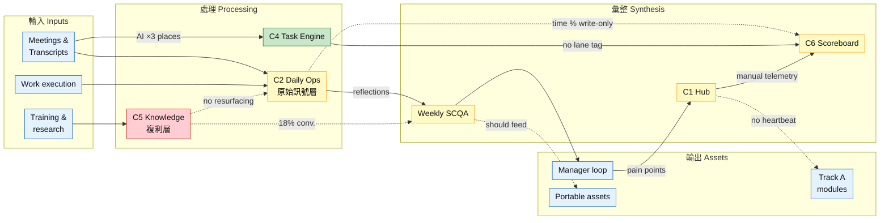
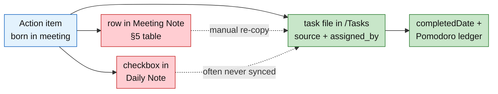
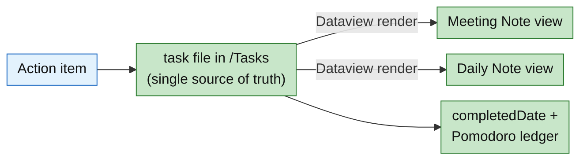
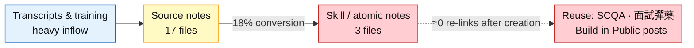

# Vault System Diagnosis — Component Flow & Problem Map

> [!note] Design constraint (decided 2026-07-02)
> Single-hub architecture is retained: [[Life @Huawei System]] stays the only 中央指揮 Hub. Every fix direction below must work **inside** one hub — no hub split.

Health legend: 🟩 green node = healthy · 🟨 yellow = friction · 🟥 red = broken/bottleneck · 🟦 blue = input/output (not judged) · dotted arrow = flow that *should* exist but is weak or absent.

---

## 1. Master Signal Flow(全系統流向圖)

How raw signal is supposed to become assets — and where it leaks.

Support components (off the main flow): **C7 Relationship Mgmt** 🟩 · **C8 Automation** 🟨(git sync 🟩 · gcal sync 🟥 · Archive missing 🟥)

**Reading the map:** the left half (capture) is strong; the leaks are all on the right half — the conversion of captured signal into scoreboard data, reusable knowledge, and Track A output. You do not have a capture problem; you have a **conversion problem**.

---

## 2. Triage Table(問題優先級)

| #   | Component            | Health | Core problem in one sentence                                                                                                     | Severity                         | Done?                                                                                                       | Follow up? |
| --- | -------------------- | ------ | -------------------------------------------------------------------------------------------------------------------------------- | -------------------------------- | ----------------------------------------------------------------------------------------------------------- | ---------- |
| C5  | Knowledge Layer      | 🔴     | 複利層 not compounding: 17 source notes → 3 atoms (18%), zero resurfacing                                                           | **High**                         | -2/7  built skill to remove friction in filling in time allocations and identifying atomic knowledge points |            |
| C4  | Task Engine          | 🟢/🟡  | Engine is healthy but action items live in 3 places; `contexts` & recurrence unused; gcal sync silently broken                   | **High** (cheap fix, big return) |                                                                                                             |            |
| C2  | Daily Operations     | 🟡     | Single point of failure for every loop; degrades to skeleton under load; time-% data is write-only                               | **High**                         |                                                                                                             |            |
| C6  | Goals & Scoreboard   | 🟡     | R/Y/G at W0 with no data feed → will become manual, then abandoned                                                               | Medium                           |                                                                                                             |            |
| C1  | Hub                  | 🟡     | Telemetry is hand-maintained snapshots (`updated: 2026-06-16` vs content edited 06-29) — a document pretending to be a dashboard | Medium                           |                                                                                                             |            |
| C3  | Meeting Pipeline     | 🟡     | Heaviest input, thinnest downstream linkage; transcripts rarely feed SCQA/knowledge                                              | Medium                           |                                                                                                             |            |
| C8  | Automation & Entropy | 🟡     | No Archive/ quadrant; 6 stubs + 1 duplicate in 3 weeks; broken gcal queue (11 tasks)                                             | Low-Medium                       |                                                                                                             |            |
| C7  | Relationships        | 🟢     | Only `last_contact` staleness and one brittle text-match query                                                                   | Low                              |                                                                                                             |            |

---

## 3. Component Problem Descriptions(元件級問題描述)

### C1 · Hub — [[Life @Huawei System]]

**Purpose:** 中央指揮; single entry point; barbell strategy + decision timelines A/B.

**Problems:**
1. **Telemetry is manual and already drifting.** Frontmatter says `updated: 2026-06-16`; content was actually edited 2026-06-29. The System Telemetry table is a hand-typed snapshot — it can silently lie, and "每次 review 手動更新" is a promise, not a mechanism.
2. **No lane visibility inside one surface.** Both 進攻/防守 share the page with no way to see "state of Track A right now" vs "state of work right now" without reading prose.
3. **Document, not dashboard.** Zero Dataview queries in the hub itself — everything it claims must be manually kept true.

**Fix direction (single-hub):** keep the hub as the one entry point, but make its telemetry *live*: replace computable rows of the telemetry table with small Dataview blocks (active tasks per lane, this week's Track A minutes, last SCQA date). The hub stays one note; it stops depending on your discipline to stay truthful.

---

### C2 · Daily Operations — `Operation Note/`

**Purpose:** 原始訊號層 — plan / execute / reflect; capture 痛點 and 常數.

**Problems:**
1. **Single point of failure.** Reflection→SCQA, task surfacing, and time telemetry all ride on one manual habit (`autorun: false` in daily-notes config). If the habit breaks, *both lanes* lose their rhythm — this is the coupling we diagnosed.
2. **Already degrading under load.** [[1-7-2026 Daily Operations]] and [[2-7-2026 Daily Operations]] are skeletal vs the complete [[29-6-2026 Daily Operations]].
3. **Write-only telemetry.** The "How is your time allocated" section is prose percentages (e.g. 29-6: 50/15/35). Captured daily, read by nothing — the blank-space KPI is being collected and discarded.
4. **Triple-entry participant.** Tasks are hand-copied in as checkboxes (see C4).

**Fix direction:** (a) daily template renders today's tasks via Dataview instead of hand-copying; (b) move time allocation into frontmatter fields (`time_core`, `time_admin`, `time_blank`) so queries can read it; (c) add a "degraded mode" — a 2-minute minimum-viable entry (3 frontmatter numbers + one line) so a bad day produces *thin data instead of no data*.

---

### C3 · Meeting Pipeline — `Operation Note/Meeting Notes` + `Meeting Transcript`

**Purpose:** convert meetings into decisions / intel / training assets (per Decision B, 2026-06-16).

**Problems:**
1. **Action items fork at birth** into meeting-note tables, daily-note checkboxes, and `/Tasks` files — no single source of truth (see C4 diagram).
2. **Heavy in, thin out.** Transcripts are the vault's bulkiest input; almost nothing links from Knowledge or SCQA back into them. `#scqa-feed` tag exists but is sparsely used.

**Fix direction:** rule — *an action item exists only as a task file* (with `source:` and `assigned_by:`, which your best tasks already carry, e.g. [[Fill FWA Roadmap Section 1.3]]). The meeting note's §5 table becomes a Dataview query: `FROM #task WHERE source = this.file.link`. Written once, rendered everywhere.

---

### C4 · Task Engine — TaskNotes + `/Tasks`

**Purpose:** single task lifecycle: assigned → scheduled → Pomodoro-tracked → completed.

**Current state — the triple-entry problem:**

**Target state:**

**Problems:**
1. **Triple-entry** (above) — the vault's #1 operational friction.
2. **`contexts` field configured but populated on zero tasks** → no lane discrimination → no per-lane KPI can be computed.
3. **Recurrence unused** → Track A has no heartbeat independent of the daily-note habit.
4. **Google Calendar sync silently broken** — 11 tasks stuck in a pending auth queue (`.obsidian/plugins/tasknotes/data.json`). Paying overhead, receiving nothing.
5. **Duplicate file:** `Account Gap and Opportunity Analysis.md` exists at vault root *and* in `/Tasks`.

**Fix direction:** adopt the target diagram; populate `contexts: [work]` / `contexts: [hub]` on all 14 tasks (10-minute job); create recurring "Track A build session" task (the heartbeat, no hub split needed); either complete gcal auth or disable sync; delete the root duplicate.

---

### C5 · Knowledge Layer — `Knowledge/` 🔴 **the bottleneck**

**Purpose:** 複利層 — one reusable proposition per note, linked into a network (hub's own words: 目前最弱、本回合主攻).

**The funnel today:**

**Problems:**
1. **Conversion stalls at Source.** 17 source notes, 3 atoms. Inventory piles up exactly at the step the hub already flagged as 系統摩擦點.
2. **No resurfacing mechanism.** Nothing queries Knowledge back into daily notes, SCQA prep, or the hub. A note never resurfaced is a graveyard entry regardless of quality.
3. **Atomization has no ritual slot.** Daily ops, SCQA, and meetings all have templates and cadence; atomization has neither — so it loses to everything that does.

**Fix direction:** attach atomization to an *existing* ritual instead of inventing a new one: SCQA prep includes "convert 1 source note → 1 atom" (weekly minimum). Add a resurfacing block to the hub or daily template: `3 atoms not linked to anything this month`. Measure conversion rate monthly — it's the vault's single most diagnostic KPI.

---

### C6 · Goals & Scoreboard — [[Career Hub Goal]]

**Purpose:** 90-day milestone (M2 ship by 2026-09-23) + weekly R/Y/G barbell balance.

**Problems:**
1. **Scoreboard has no data feed.** R/Y/G at W0 will be filled by feel, not measurement — manual scoreboards get abandoned by week 4. The data it needs (Pomodoro `timeEntries` per lane) already exists but is unreadable without C4's `contexts` fix.
2. **Governance data already stale:** [[FWA Business Development]] shows `due: 2026-06-18` — overdue 2 weeks while `status: active`. Dates that don't mean anything train you to ignore dates.

**Fix direction:** scoreboard cells computed by Dataview — Track A minutes this week (from `@hub`-context task timeEntries) vs the 4–5h target; red/yellow/green assigned by threshold, not mood. Re-baseline or remove dead due dates.

---

### C7 · Relationship Management — `Relationship Management/`

**Purpose:** contact database with per-person interaction history. **Mostly healthy** — 17 contacts, live backlink queries, `assigned_by` integration with tasks.

**Problems:**
1. `last_contact` is manually maintained and stale (some at 2026-06-17) while the same note *derives* recent meetings via Dataview — redundant manual field shadowing an automatic one.
2. The open-action-items query matches on `contains(text, this.file.name)` — brittle string matching; breaks on aliases.

**Fix direction:** low priority. Drop manual `last_contact` (or accept it as approximate); rely on the meeting-backlink query as truth.

---

### C8 · Automation & Entropy — `scripts/`, templates, `.obsidian`

**Purpose:** keep the system running without cognitive spend.

**Working:** git auto-sync (weekdays 17:00, log current to 2026-07-02) 🟢; stable template set 🟢; TaskNotes NLP quick-capture configured 🟢.

**Problems:**
1. **No `Archive/`** — the missing PARA quadrant. Entropy has nowhere to drain: 6 stub/untitled files, 1 duplicate, and an empty `Books/` after only 3 weeks.
2. **Broken gcal sync** (see C4) — the only automation that costs without paying.
3. **Daily note creation is manual** (`autorun: false`) — deliberate or accidental, it's the trigger for the C2 single point of failure.

**Fix direction:** create `Archive/` + a monthly 10-minute sweep (stubs, dead dues, finished projects); resolve gcal in or out; consider `autorun: true` so the daily note *exists* even on days you don't fill it (thin data > no data, and the day-counter query already handles the "not created yet" case).

---

## 4. KPI Hooks(診斷 → 儀表板的接線)

Each KPI from the system review, and which component fix unblocks it:

| KPI | Blocked by | Unblocked when |
|---|---|---|
| Track A hours/week vs 4–5h target | C4 (no `contexts`) | contexts populated → Dataview sums `timeEntries` per lane |
| Strategic blank-space % trend | C2 (prose, not fields) | time allocation moves to frontmatter |
| Knowledge conversion rate (Source→Atom) | C5 (no ritual slot) | weekly atomization step; folder counts are query-able today |
| Action-item cycle time | C3/C4 (triple entry) | single source of truth → `dateCreated`→`completedDate` is trustworthy |
| Barbell R/Y/G weekly | C6 (no data feed) | all of the above |

---

*Maintained by Claude Code sessions. Diagrams are Mermaid — edit as text, or ask Claude to update them as components change.*
